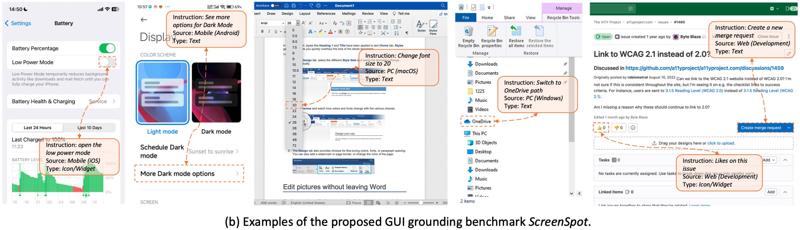
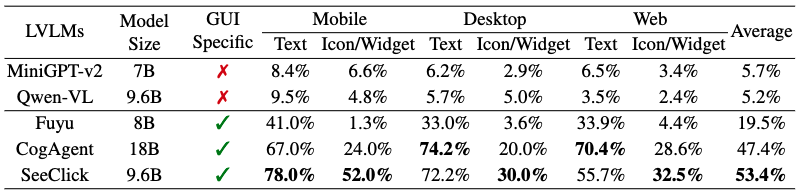

# SeeClick: Harnessing GUI Grounding for Advanced Visual GUI Agents

[](https://arxiv.org/abs/2401.10935) 
[](https://GitHub.com/Naereen/StrapDown.js/graphs/commit-activity) 
[](http://makeapullrequest.com)
[](https://awesome.re)

The model, data, and code for the paper: [SeeClick: Harnessing GUI Grounding for Advanced Visual GUI Agents](https://arxiv.org/abs/2401.10935)

Release Plans:

- [x] GUI grounding benchmark: *ScreenSpot*
- [x] Data for the GUI grounding Pre-training of SeeClick
- [x] Inference code & model checkpoint
- [x] Other code and resources
- [x] Code for pre-training and evaluation on ScreenSpot
- [x] Code for collecting pre-training data

News: SeeClick will appear in [ICLR 2024 Workshop on LLM Agents](https://llmagents.github.io/) as a poster paper.

***
### GUI Grounding Benchmark: *ScreenSpot*

*ScreenSpot* is an evaluation benchmark for GUI grounding, comprising over 1200 instructions from iOS, Android, macOS, Windows and Web environments, along with annotated element types (Text or Icon/Widget). See details and more examples in our paper.

Download the images and annotations of [*ScreenSpot*](https://box.nju.edu.cn/d/5b8892c1901c4dbeb715/) (or download with [Google Drive](https://drive.google.com/drive/folders/1FuFT05yXOV_QxhwYft85YTLOgaIYm_fS?usp=sharing)). 

Each test sample contain: 
* `img_filename`: the interface screenshot file
* `instruction`: human instruction
* `bbox`: the bounding box of the target element corresponding to instruction
* `data_type`: "icon"/"text", indicates the type of the target element
* `data_souce`: interface platform, including iOS, Android, macOS, Windows and Web (Gitlab, Shop, Forum and Tool)



#### Evaluation Results

| LVLMs      | Model Size | GUI Specific | Mobile Text | Mobile Icon/Widget | Desktop Text | Desktop Icon/Widget | Web Text | Web Icon/Widget | Average |
|------------|------------|--------------|-------------|--------------------|--------------|---------------------|----------|-----------------|---------|
| MiniGPT-v2 | 7B         | ❌            | 8.4%        | 6.6%               | 6.2%         | 2.9%                | 6.5%     | 3.4%            | 5.7%    |
| Qwen-VL    | 9.6B       | ❌            | 9.5%        | 4.8%               | 5.7%         | 5.0%                | 3.5%     | 2.4%            | 5.2%    |
| GPT-4V     | -          | ❌            | 22.6%       | 24.5%              | 20.2%        | 11.8%               | 9.2%     | 8.8%            | 16.2%   |
| Fuyu       | 8B         | ✅            | 41.0%       | 1.3%               | 33.0%        | 3.6%                | 33.9%    | 4.4%            | 19.5%   |
| CogAgent   | 18B        | ✅            | 67.0%       | 24.0%              | **74.2%**    | 20.0%               | **70.4%**| 28.6%           | 47.4%   |
| SeeClick       | 9.6B       | ✅            | **78.0%**   | **52.0%**          | 72.2%        | **30.0%**           | 55.7%    | **32.5%**       | **53.4%**|


<!--  -->

***
### GUI Grounding Pre-training Data for SeeClick
Check [data](readme_data.md) for the GUI grounding pre-training datasets,
including the first open source large-scale web GUI grounding corpus collected from Common Crawl.

***
### Inference code & model checkpoint
SeeClick is built on [Qwen-VL](https://github.com/QwenLM/Qwen-VL) and is compatible with its Transformers 🤗 inference code.

All you need is to input a few lines of codes as the examples below.

Before running, set up the environment and install the required packages.
```angular2html
pip install -r requirements.txt
```
Then,
```python
import torch
from transformers import AutoModelForCausalLM, AutoTokenizer
from transformers.generation import GenerationConfig

tokenizer = AutoTokenizer.from_pretrained("Qwen/Qwen-VL-Chat", trust_remote_code=True)
model = AutoModelForCausalLM.from_pretrained("SeeClick-ckpt-dir", device_map="cuda", trust_remote_code=True, bf16=True).eval()
model.generation_config = GenerationConfig.from_pretrained("Qwen/Qwen-VL-Chat", trust_remote_code=True)

img_path = "assets/test_img.png"
prompt = "In this UI screenshot, what is the position of the element corresponding to the command \"{}\" (with point)?"
# prompt = "In this UI screenshot, what is the position of the element corresponding to the command \"{}\" (with bbox)?"  # Use this prompt for generating bounding box
ref = "add an event"   # response (0.17,0.06)
ref = "switch to Year"   # response (0.59,0.06)
ref = "search for events"   # response (0.82,0.06)
query = tokenizer.from_list_format([
    {'image': img_path}, # Either a local path or an url
    {'text': prompt.format(ref)},
])
response, history = model.chat(tokenizer, query=query, history=None)
print(response)
```
The SeeClick's checkpoint can be downloaded on [huggingface](https://huggingface.co/cckevinn/SeeClick/tree/main).
Please replace the `SeeClick-ckpt-dir` with the actual checkpoint dir. 

The prediction output represents the point of `(x, y)` or the bounding box of `(left, top, right, down)`,
each value is a [0, 1] decimal number indicating the ratio of the corresponding position to the width or height of the image.
We recommend using point for prediction because SeeClick is mainly trained for predicting click points on GUIs.

Thanks to [Qwen-VL](https://github.com/QwenLM/Qwen-VL) for their powerful model and wonderful open-sourced work.

***
### Downstream Agent Task
Check [here](agent_tasks/readme_agent.md) to get details of training and testing on three downstream agent tasks,
which also provides a guideline for fine-tuning SeeClick.
```
bash finetune/finetune_lora_ds.sh --save-name SeeClick_test --max-length 704 --micro-batch-size 4 --save-interval 500 
    --train-epochs 10 --nproc-per-node 2 --data-path xxxx/data_sft.json --learning-rate 3e-5 
    --gradient-accumulation-steps 8 --qwen-ckpt xxxx/Qwen-VL-Chat --pretrain-ckpt xxxx/SeeClick-pretrain
    --save-path xxxx/checkpoint_qwen
```
* `data-path`: generated sft data, the format can be found in [here](https://github.com/QwenLM/Qwen-VL#data-preparation)
* `qwen-ckpt`: origin Qwen-VL ckpt path for loading tokenizer
* `pretrain-ckpt`: base model for fine-tuning, e.g. SeeClick-pretrain or Qwen-VL
* `save-path`: directory to save training checkpoints

The fine-tuning scripts are similar to Qwen-VL, except for we use LoRA to fine-tune customized parameters, as in `finetune/finetune.py lines 315-327`.
This scripts fine-tune pre-train LVLM with LoRA and multi-GPU training; for more option like full-finetuning, Q-LoRA and single-GPU training, please
refer to [Qwen-VL](https://github.com/QwenLM/Qwen-VL/tree/master?tab=readme-ov-file#finetuning).

***
### Pre-training and Evaluation on ScreenSpot
You can easily organize the above data yourself for model training and testing on ScreenSpot. 
As an alternative, we provide a set of scripts used for data processing, pre-training, and testing on ScreenSpot.
```
cd pretrain
```
#### Data Processing for Pre-Training
```
python pretrain_process.py --mobile_imgs xxxx/combined --web_imgs xxxx/seeclick_web_imgs 
    --widgetcap_json xxxx/widget_captioning.json --ricosca_json xxxx/ricosca.json 
    --screensum_json xxxx/screen_captioning.json --web_json xxxx/seeclick_web.json 
    --coco_imgs xxxx/coco/train2017 --llava_json xxxx/llava_instruct_150k.jsonl
```
Generate the dataset containing about 1M samples for continual pre-training at `../data/sft_train.json`.

#### GUI Grounding Pre-training
```
cd ..
bash finetune/finetune_lora_ds.sh --save-name seeclick_sft --max-length 768 --micro-batch-size 8 
    --save-interval 4000 --train-epochs 3 --nproc-per-node 8 --data-path ./data/sft_train.json 
    --learning-rate 3e-5 --gradient-accumulation-steps 1 --qwen-ckpt xxxx/Qwen-VL-Chat 
    --pretrain-ckpt xxxx/Qwen-VL-Chat  --save-path xxxx/checkpoint_qwen
```
#### Evaluation on ScreenSpot
```
cd pretrain
python screenspot_test.py --qwen_path xxxx/Qwen-VL-Chat --lora_path xxxx/checkpoint_qwen/seeclick_sft/checkpoint-20000 --screenspot_imgs xxxx/screenspot_imgs --screenspot_test xxxx/ScreenSpot --task all
```
***
### Collecting Pre-training Data from Common Crawl
We used Selenium to crawl web pages from Common Crawl. See details in this [repo](https://github.com/chuyg1005/seeclick-crawler).

***
### Citation
```
@misc{cheng2024seeclick,
      title={SeeClick: Harnessing GUI Grounding for Advanced Visual GUI Agents}, 
      author={Kanzhi Cheng and Qiushi Sun and Yougang Chu and Fangzhi Xu and Yantao Li and Jianbing Zhang and Zhiyong Wu},
      year={2024},
      eprint={2401.10935},
      archivePrefix={arXiv},
      primaryClass={cs.HC}
}
```

***
### License 
This project incorporates specific datasets and checkpoints governed by their original licenses. Users are required to adhere to all terms of these licenses. No additional restrictions are imposed by this project beyond those specified in the original licenses.